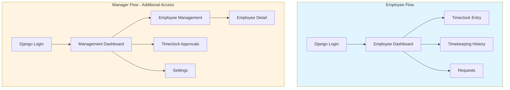

# About Time - Product Requirements Document

## Executive Summary

An operational web application for a broadcast facility providing employee time tracking and time-off request management. The system supports 20-30 employees with 3-5 concurrent users, managing holiday, leave, and TOIL (Time Off In Lieu) balances.

**Primary Goal**: Enable timekeeping and time-off management for a single business unit with separate interfaces for employees and managers.

## Architecture

### Frontend

- React 18.3.1 with TypeScript 5.4.5
- Webpack 5.91.0 (build tool)

### Backend

- [Python](https://www.python.org/) version: >=3.12
- [Django](https://www.djangoproject.com/) version: >=5.2
- [PostgreSQL](https://www.postgresql.org/) version: >=18
- [Celery](https://docs.celeryq.dev/) version: >=5.3.6
- [Redis](https://redis.io/) (for Celery message broker)
- [Docker](https://www.docker.com/)

### Authentication

- Django session-based authentication with CSRF protection
- SPA-compatible authentication flow
- Session timeout: 4 hours of inactivity
- Password complexity: Minimum 8 characters with letters and numbers

## Project Structure

### Critical: Directory Organization

The project uses a **frontend subdirectory** structure. All React code MUST be inside the `frontend/` directory:

```text
about-time/
├── backend/                    # Django backend
│   ├── common/                # Shared Django app
│   ├── users/                 # User management app
│   ├── project_name/          # Main Django project
│   ├── templates/             # Django templates
│   ├── manage.py
│   └── Dockerfile
├── frontend/                   # React frontend
│   ├── js/                    # React components and logic
│   ├── css/                   # Stylesheets
│   ├── assets/                # Static assets
│   └── Dockerfile
├── docs/                      # Documentation
├── docker-compose.yml         # Development environment
├── package.json               # Node.js dependencies
├── pyproject.toml             # Python dependencies
└── README.md
```

## MVP Scope: Core Timekeeping & Requests

**Goal**: Establish complete time tracking and approval workflow with time-off management

**Features**:

- User authentication and role management (Employee/Manager)
- Employee Dashboard with time balances
- Timeclock entry submission and editing
- Timeclock approval workflow
- Request submission (Holiday/Leave/TOIL)
- Request approval workflow
- Employee management (list, detail, balance adjustments)
- Time balance tracking (Holiday, TOIL, OT)
- Settings page (OT calculation, timezone, pay period)
- In-app notifications for managers
- Basic reports (Timecard, Balance)
- Audit logging

**Pages Included**:

- Login
- Employee Dashboard
- Timeclock Entry
- Timekeeping History
- Requests
- Management Dashboard
- Employee Management
- Employee Detail
- Timeclock Approvals
- Settings

**Success Criteria**:

- Employees can submit and edit timeclock entries
- Managers can approve/reject entries and requests
- OT calculations work correctly based on settings
- Time balances update correctly when requests are approved/cancelled
- All data properly audited
- 100% of timeclock entries submitted through system (no paper/spreadsheets)
- All employees and managers actively using the system

**Estimated Complexity**: Medium - Standard CRUD with approval workflows

## User Roles & Permissions

### Employee (User)

- View personal dashboard and time balances
- Submit timeclock entries
- Create and cancel requests (holiday, leave, TOIL)
- Edit own timeclock entries (until approved)
- View personal timekeeping history

### Manager

- All employee permissions
- Access management dashboard
- Approve/reject timeclock entries
- Approve/reject requests (holiday, leave, TOIL)
- View and manage all employee data
- Edit any timeclock entry (including approved)
- Ad hoc adjustment of employee time balances
- Access all reports
- Change user roles (promote/demote employees to/from Manager role via Employee Detail page)

**Role Assignment Process**:

- Managers can change user roles via the Employee Detail page
- Role changes are immediate and logged in audit trail

**Assumption**: All managers can change user roles in MVP. TODO: Validate if permission matrix needed for role management in production (e.g., admin-level managers only).

## Business Rules

### Overtime Calculation

**Configurable in Settings:**

- OT Calculation Method: Per Day OR Per Week
- OT Week Start Day: Selectable (if weekly calculation)
- OT Threshold Hours: Hours before OT applies
- OT Multiplier: Selectable (1x, 1.5x, 2x)
- OT Payout Method: Paycheck OR TOIL (Time Off In Lieu)

**Note**: Only one OT multiplier applies system-wide. Multiple tier rates (e.g., 1.5x after 8hrs, 2x after 10hrs) are not supported in MVP.

**OT Settings Changes**: Settings changes apply to new timeclock entries only, not retroactively to existing entries. Entries retain the OT calculation method in effect at time of creation. TODO: Edge case testing for pay period transitions when settings change mid-period.

### Holiday & Leave Management

- **Holiday**: Deducted from employee holiday bank, requires approval
- **Leave**: Does not deduct from bank, requires approval, can be post-dated (e.g., sick leave)
- **TOIL**: Only available if TOIL is activated in settings, deducted from TOIL bank, requires approval
- Holiday balances adjusted ad hoc by managers on Employee Detail page
- Cancelled requests return time to appropriate banks

**TOIL Expiration**:

- TOIL balances do not expire automatically
- Managers can manually adjust TOIL balances as needed via Employee Detail page

**Holiday Accrual**:

- Standard accrual: 160 hours per year (20 days at 8 hours/day)
- Employees can have different entitlements (set manually by managers via Employee Detail page)
- TODO: Automated accrual calculation and annual rollover (Phase 2)

**Leave Management**:

- "Post-dated leave" (e.g., sick leave already taken) can be submitted retroactively and requires manager approval
- Negative balances are allowed for emergency situations (no hard limit in MVP)
- Managers review negative balances during approval process

### Timeclock Entry & Approval

- Employees can submit timeclock entries at any time (no deadline)
- Entries are editable by employee until approved
- After approval, only managers can edit
- Approvals should occur within 1 week of entry
- End-of-month notification sent to managers for unapproved entries

**Approval Workflow**:

- Warning notification sent to managers at 7 days after submission
- Escalation notification sent at 14 days after submission
- No automatic cutoff for editing previous months in MVP
- End-of-month reminder delivered via in-app notification
- TODO: Define auto-approve policy for entries older than X days (requires stakeholder decision)

### General Settings

- Timezone: Selectable in settings
- Pay Period: Selectable (currently monthly)
- **Timeclock entries cannot span midnight** - Hard block in UI, entries must be completed within a single day

## Application Structure

### Navigation Flow



**Note**: Managers have access to both Employee and Manager flows.

## Page Specifications

### Employee Pages

#### Login Page

- Standard Django authentication
- Username and password fields
- "Remember me" option
- Password reset link
- Session expires after 4 hours of inactivity

**Password Requirements**:

- Minimum 8 characters
- Must contain both letters and numbers

**Security Features**:

- TODO: Password reset via Django built-in email workflow (Phase 1.5 - requires email configuration)
- TODO: Failed login lockout after 5 attempts with 15-minute cooldown (Phase 1.5)

#### Employee Dashboard

**Purpose**: Central hub for employee daily operations

**Components**:

- **Time Balances Display**:
  - Holiday balance (hours/days)
  - TOIL balance (hours/days) - if activated
  - OT balance (hours)
  - Leave used (current period)
- **Quick Actions**:
  - "Submit Time Entry" button → Timeclock Entry page
  - "New Request" button → Requests page
- **Recent Activity**:
  - Recent timeclock entries
  - Recent requests and their status

**Display Format**:

- Time balances displayed in both hours and days: "80 hours (10 days)"
- Standard conversion: 1 day = 8 hours
- Leave used tracked for current pay period (display only, not deducted from balances)

#### Timeclock Entry Page

**Purpose**: Submit time worked

**Fields**:

- Date selector (defaults to current date, changeable)
- Start time (24h format)
- End time (24h format)
- Break time (duration in minutes/hours)
- Notes (optional, freeform text describing work performed)

**Calculations**:

- Total hours = (End time - Start time) - Break time
- OT hours calculated based on settings (display on form before submit)

**Behaviors**:

- Form validation: End time must be after start time
- Hard block prevents entries spanning midnight (single-day only per line 189)
- Warn if entry overlaps with existing entry for same date
- Editable by employee until approved
- Break time represents total daily breaks (single cumulative value)
- OT hours calculation displayed on form before submission (live calculation as user types)

#### Timeclock Detail Page

**Purpose**: View details of a specific timeclock entry

**Display**:

- All entry fields (read-only or editable based on approval status)
- Calculated total hours
- Calculated OT hours
- Approval status (Pending/Approved/Rejected)
- Approver name and approval date (if approved)
- Edit history (who edited, when)

**Actions**:

- Edit button (if not approved and is own entry)
- Cancel button (if not approved and is own entry)

**Note**: Entries are soft-deleted (marked as cancelled) rather than hard-deleted to preserve audit trail integrity.

#### Timekeeping History Page

**Purpose**: View all personal timeclock entries

**Display**:

- Table of recent entries (default: last 30 days)
  - Date
  - Hours worked
  - OT hours
  - Approval status
  - Notes
- Filters:
  - Date range: Last 7 days / Last 30 days / Last 90 days / Custom range / Current pay period
  - Approval status: All / Pending / Approved / Rejected
- Pagination (50 entries per page)

#### Requests Page

**Purpose**: Manage holiday, leave, and TOIL requests

**Display**:

- Table of all personal requests
  - Request type (Holiday/Leave/TOIL)
  - Start date
  - End date
  - Duration (hours/days)
  - Status (Pending/Approved/Rejected)
  - Submitted date
  - Approver (if processed)
- Filters: Request type, status, date range

**Actions**:

- "New Request" button → Opens popup form
- "Cancel" button on pending requests (returns time to bank)

**New Request Form (Popup)**:

- Request type: Holiday / Leave / TOIL
- Start date
- End date
- Duration: Quick select (Full day = 8hrs / Half day = 4hrs) or custom hours entry
- Notes/reason (optional)
- Display current balance for selected type
- Submit button

**Request Rules**:

- Duration calculated in hours for precision
- Requests can span multiple pay periods (based on calendar days)
- Basis: Calendar days (includes weekends)
- No minimum/maximum duration limit in MVP
- Rejection reason optional but encouraged for communication

### Manager Pages

#### Management Dashboard

**Purpose**: Central hub for manager operations

**Components**:

- **Employee Summary**:
  - Total active employees
  - Employees with pending time entries
  - Employees on holiday/leave today
- **Pending Approvals Summary**:
  - Count of pending timeclock entries (with age indicator)
  - Count of pending requests
  - Quick link to approval pages
- **Quick Links**:
  - Employee Management
  - Timeclock Approvals
  - Settings
- **Recent Activity**:
  - Recently approved entries
  - Recently processed requests

#### Employee Management Page

**Purpose**: Overview of all employees

**Display**:

- Table of all employees
  - Name
  - Current OT balance
  - Pending holiday hours
  - Holiday balance
  - TOIL balance (if activated)
  - Active status (Active/Inactive)
- Search/filter by name or status
- Click row → Employee Detail page

**Employee Status**:

- Active: Currently employed
- Inactive: No longer employed (retained for historical records and audit trail)
- "On Leave" calculated dynamically from approved requests (displayed as badge, not a separate status)

#### Employee Detail Page

**Purpose**: Detailed employee information and balance management

**Display**:

- **Personal Information**:
  - Full name
  - Contact information (phone, email, address)
  - Emergency contact name
  - Emergency contact phone
  - Start date
  - Employee ID/number
  - Active status
  - **User Role**: Dropdown selector (Employee / Manager)
- **Time Balances**:
  - Holiday balance with adjustment controls
  - TOIL balance with adjustment controls
  - OT balance (calculated, read-only)
  - Leave taken (current period, read-only)
- **Ad Hoc Adjustment Form**:
  - Balance type (Holiday/TOIL)
  - Adjustment amount (+/-)
  - Reason (required for audit)
  - Submit button

**Actions**:

- Edit employee information (including role assignment)
- Change user role (Employee ↔ Manager)
- View employee's timeclock history
- View employee's requests

**Role Management**:

- Managers can promote employees to Manager role or demote to Employee role
- Role changes take effect immediately
- Role changes are logged in audit trail

**Employee Data Requirements**:

- Required fields: First name, last name, email, phone
- Optional fields: Address, emergency contact, employee ID, start date
- Custom OT settings per employee not supported in MVP (system-wide settings only)
- See User/Employee Model (line 658+) for complete field definitions

**Note**: Event Management and Event Creation pages are planned for Phase 2. See "Appendix A: Future Enhancements Detail" for complete specifications.

#### Timeclock Approvals Page

**Purpose**: Approve or reject timeclock entries and requests

**Timeclock Entries Section**:

- Table of pending timeclock entries
  - Employee name
  - Date
  - Event
  - Hours worked
  - OT hours
  - Submitted date
  - Age (days since submitted)
- Bulk selection checkboxes
- "Approve Selected" button
- "Reject Selected" button
- Click row for detail view with individual approve/reject

**Requests Section**:

- Table of pending requests (Holiday/Leave/TOIL)
  - Employee name
  - Request type
  - Start date
  - End date
  - Duration
  - Submitted date
  - Current balance (for employee)
- Click row for detail view with approve/reject
- Individual approve/reject buttons

**Approval Rules**:

- Rejection reason optional but encouraged for employee communication
- No partial approval in MVP (approve all or reject all)
- Employees notified via in-app notification when entries/requests are processed

#### Settings Page

**Purpose**: Configure system-wide settings

**Sections**:

**Overtime Settings**:

- OT Calculation Method: Radio buttons (Per Day / Per Week)
- Week Start Day: Dropdown (if Per Week selected)
- OT Threshold Hours: Number input
- OT Multiplier: Dropdown (1x, 1.5x, 2x)
- OT Payout Method: Radio buttons (Paycheck / TOIL)
- Enable TOIL: Checkbox

**General Settings**:

- Timezone: Dropdown (standard timezone list)
- Pay Period: Dropdown (Weekly / Bi-weekly / Monthly)
- Default Currency: Text input
- Date Format: Dropdown

**Notification Settings**:

- Timeclock approval deadline: Number input (days)
- End of month reminder: Checkbox

**Settings Access & Changes**:

- All managers can access Settings in MVP
- TODO: Validate if admin-level manager role needed for Settings access in production
- Settings changes logged in audit trail (user, timestamp, old/new values)
- Settings changes apply only to new entries created after change (not retroactive)
- Complete list of configurable settings documented in SystemSettings Model (line 808+)

## UI/UX Design & Wireframes

TODO: Create wireframes and UI mockups for key pages before development begins

**Priority Pages for Wireframing**:

1. **Employee Dashboard** - Most frequently used page, needs intuitive layout
2. **Timeclock Entry** - Critical user flow, must be simple and quick
3. **Management Dashboard** - Hub for manager workflows
4. **Timeclock Approvals** - Bulk approval interface needs careful UX design
5. **Requests** - Time-off request interface

**Design Considerations**:

- Mobile-first approach for potential future mobile support
- Accessibility compliance (WCAG 2.1 AA minimum)
- Consistent navigation patterns across all pages
- Visual distinction between Employee and Manager interfaces
- Clear feedback for all user actions (success/error states)
- Loading states for async operations
- Responsive design for various screen sizes

**Actions Required**:

- Research and collect examples of similar time tracking interfaces
- Define color scheme and branding guidelines
- Create low-fidelity wireframes for core pages
- User testing with 2-3 target users before final design
- Define component library (buttons, forms, tables, modals, etc.)

**Design Decisions Needed**:

- TODO: Find and document 5-10 examples of good time tracking UIs for reference (Design Phase)
- TODO: Define if custom design system or use existing UI framework like Material UI, Ant Design, etc. (Design Phase)
- TODO: Confirm accessibility requirements and WCAG compliance level needed (Design Phase)
- TODO: Define responsive breakpoints - mobile (320-768px), tablet (769-1024px), desktop (1025px+) (Design Phase)

## Data Models

**⚠️ NOTE: These are PRELIMINARY schema designs subject to change during development.**

### User/Employee Model

```python
# Extends Django's built-in User model
Employee:
    # Django User fields (inherited)
    - username: string (unique)
    - email: string
    - password: hashed string
    - first_name: string
    - last_name: string
    - is_active: boolean

    # Custom employee fields
    - employee_id: string (unique, nullable)
    - role: enum ['EMPLOYEE', 'MANAGER']
    - phone: string (nullable)
    - address_line1: string (nullable)
    - address_line2: string (nullable)
    - city: string (nullable)
    - postal_code: string (nullable)
    - country: string (nullable)
    - emergency_contact_name: string (nullable)
    - emergency_contact_phone: string (nullable)
    - start_date: date (nullable)
    - holiday_balance_hours: decimal (default: 0)
    - toil_balance_hours: decimal (default: 0)
    - created_at: datetime
    - updated_at: datetime
```

**Required Fields**:

- first_name, last_name (name)
- email, phone (basic contact info)

**Optional Fields**:

- All address fields, emergency contact, employee_id, start_date

**Model Implementation**:

- Extend Django User with OneToOne Employee Profile model
- Employee ID auto-generated with format "EMP-{year}-{sequence}" (e.g., EMP-2025-001)
- TODO: Employment status field (Full-time, Part-time, Contract) deferred to Phase 2

### Timeclock Entry Model

```python
TimeclockEntry:
    - id: integer (primary key)
    - employee: foreign key → Employee
    - entry_date: date
    - start_time: time
    - end_time: time
    - break_minutes: integer (default: 0)
    - notes: text (nullable)
    - total_hours: decimal (calculated)
    - ot_hours: decimal (calculated)
    - status: enum ['PENDING', 'APPROVED', 'REJECTED']
    - approved_by: foreign key → Employee (nullable)
    - approved_at: datetime (nullable)
    - rejection_reason: text (nullable, optional)
    - created_at: datetime
    - updated_at: datetime
    - created_by: foreign key → Employee (for audit)
    - last_modified_by: foreign key → Employee (for audit)

**Note**: Rejection reasons are optional but encouraged for better communication and audit trail.
```

**Constraints**:

- Check: end_time > start_time
- Check: break_minutes >= 0
- **Business rule**: Timeclock entries cannot span midnight (both start_time and end_time must be within same calendar day)
- **Multiple entries per day allowed** (no unique constraint on employee+date) to support split shifts

**Note**: Remove unique constraint on (employee, entry_date) to allow multiple entries per day for split shift scenarios.

**Multiple Entries Per Day**:

- Entries spanning midnight prevented by hard block (see line 194)
- Therefore entries never span pay periods (always single-day)
- UI displays multiple entries for same day as separate rows in history table
- Each entry submitted via separate form submission (no combined multi-entry form in MVP)

### Request Model

```python
Request:
    - id: integer (primary key)
    - employee: foreign key → Employee
    - request_type: enum ['HOLIDAY', 'LEAVE', 'TOIL']
    - start_date: date
    - end_date: date
    - duration_hours: decimal
    - notes: text (nullable)
    - status: enum ['PENDING', 'APPROVED', 'REJECTED', 'CANCELLED']
    - approved_by: foreign key → Employee (nullable)
    - approved_at: datetime (nullable)
    - rejection_reason: text (nullable, optional)
    - cancelled_at: datetime (nullable)
    - created_at: datetime
    - updated_at: datetime
```

**Note**: Rejection reasons are optional but encouraged for employee communication.

**Business Logic**:

- On approval: Deduct duration_hours from appropriate balance (holiday_balance or toil_balance)
- On cancellation: Return duration_hours to appropriate balance
- Leave type does not affect balances

**Duration Calculation**:

- **Basis**: Calendar days (including weekends)
- **Partial day support**: Yes - requests can be in hours (e.g., 4 hours for half-day)
- Duration stored in hours for precision

**Request Modification**:

- Submitted requests cannot be edited (preserves audit trail)
- To change a request: cancel pending request and submit new one
- Cancellation returns hours to appropriate balance
- Common duration presets in UI: Full day (8 hours), Half day (4 hours), Custom hours

### Balance Adjustment Model

```python
BalanceAdjustment:
    - id: integer (primary key)
    - employee: foreign key → Employee
    - adjustment_type: enum ['HOLIDAY', 'TOIL']
    - amount_hours: decimal (can be negative)
    - reason: text (required)
    - adjusted_by: foreign key → Employee (manager)
    - created_at: datetime
```

**Purpose**: Audit trail for ad-hoc balance adjustments made by managers

**Approval Workflow**:

- Adjustments take effect immediately (no secondary approval required)
- All adjustments are logged with manager ID, reason, and timestamp for audit trail
- Reason field is required to ensure accountability

**Model Design**:

- Kept as separate model (not generic audit log) for clear balance adjustment tracking and reporting
- Provides dedicated interface for balance adjustment history and auditing

### System Settings Model

```python
SystemSettings:
    - id: integer (primary key, singleton - only one record)
    - ot_calculation_method: enum ['PER_DAY', 'PER_WEEK']
    - ot_week_start_day: integer (0-6, 0=Monday)
    - ot_threshold_hours: decimal
    - ot_multiplier: decimal (1.0, 1.5, 2.0)
    - ot_payout_method: enum ['PAYCHECK', 'TOIL']
    - toil_enabled: boolean
    - timezone: string (e.g., 'America/New_York')
    - pay_period: enum ['WEEKLY', 'BIWEEKLY', 'MONTHLY']
    - currency: string (default: 'USD')
    - date_format: string (default: 'YYYY-MM-DD')
    - timeclock_approval_deadline_days: integer (default: 7)
    - enable_end_of_month_reminder: boolean (default: true)
    - updated_by: foreign key → Employee
    - updated_at: datetime
```

**Settings Management**:

- TODO: Settings version history tracking deferred to Phase 2 (MVP tracks only current settings and last change)
- Employee groups with different settings not supported in MVP (system-wide settings only)
- All settings changes logged in audit trail

### Notification Model

```python
Notification:
    - id: integer (primary key)
    - recipient: foreign key → Employee
    - notification_type: enum ['TIMECLOCK_OVERDUE', 'PENDING_REQUEST', 'END_OF_MONTH', 'REQUEST_PROCESSED', 'TIMECLOCK_APPROVED']
    - title: string
    - message: text
    - related_object_type: string (nullable, e.g., 'TimeclockEntry', 'Request')
    - related_object_id: integer (nullable)
    - is_read: boolean (default: false)
    - read_at: datetime (nullable)
    - created_at: datetime
```

**Notification Display**:

- Displayed in badge icon in header with dropdown list
- Users can dismiss notifications manually
- Sorted by date descending (newest first)
- TODO: Define notification priority levels (High/Medium/Low) for Phase 2
- TODO: Auto-deletion policy - delete read notifications after 30 days (Phase 2)

### Audit Log Model

```python
AuditLog:
    - id: integer (primary key)
    - user: foreign key → Employee
    - action: enum ['CREATE', 'UPDATE', 'DELETE', 'APPROVE', 'REJECT', 'ROLE_CHANGE', 'LOGIN', 'LOGOUT']
    - model_name: string (e.g., 'TimeclockEntry', 'Employee')
    - object_id: integer
    - changes: JSON (field: {old_value, new_value})
    - ip_address: string (nullable)
    - user_agent: string (nullable)
    - created_at: datetime
```

**Purpose**: Complete audit trail for compliance and debugging

**Key Actions Logged**:

- User role changes (ROLE_CHANGE)
- Balance adjustments (UPDATE on Employee)
- Timeclock approvals/rejections (APPROVE, REJECT)
- Request approvals/rejections (APPROVE, REJECT)
- Settings changes (UPDATE on SystemSettings)
- Login/logout events (LOGIN, LOGOUT)

**Audit Log Management**:

- TODO: Retention policy - 7 years per compliance standard; archival strategy TBD
- TODO: Access control - define who can view audit logs (managers only? admin-level only?)
- Single unified audit log sufficient for MVP (no separate security audit log)

### Entity Relationship Summary

```text
Employee (1) ──── (many) TimeclockEntry
Employee (1) ──── (many) Request
Employee (1) ──── (many) BalanceAdjustment [as target]
Employee (1) ──── (many) BalanceAdjustment [as adjuster]
Employee (1) ──── (many) Notification
Employee (1) ──── (many) AuditLog

TimeclockEntry (many) ──── (1) Employee [as approver]
Request (many) ──── (1) Employee [as approver]

SystemSettings (singleton)
```

**Relationship Rules**:

- Cascade delete behavior: Soft-delete employees (set is_active=False) to preserve audit trail
- When employee deactivated, all related records retained for historical reporting
- No many-to-many relationships in MVP (all relationships are one-to-many or one-to-one)

## Notifications & Alerts

**In-App Notifications for Managers** (MVP):

- Pending timeclock entries older than 7 days
- Pending requests awaiting approval
- End of month unapproved timeclock entries

**Notification Implementation** (see Notification Model line 848+):

- Display: Badge icon in header with dropdown list
- Persistence: Manual dismiss by user; notifications remain until dismissed
- Sorting: Date descending (newest first)
- Auto-clear: Notifications do not auto-clear when underlying issue resolved
- Future: Email/SMS notifications planned for Phase 2 (requires email service configuration)

## Reports & Exports

### Required Reports

1. **Monthly Timecard Report**

   - All employees or single employee
   - Date range
   - Shows: Date, Hours, OT, Notes, Total
   - Formats: PDF, Excel, CSV

2. **Holiday/Leave Report**
   - All employees or single employee
   - Shows: Balance, taken, remaining, upcoming approved requests
   - Formats: PDF, Excel, CSV

**Export Functionality**:

- Configurable CSV export for payroll integration
- **Pre-configured templates**: Common formats (ADP, Paychex, generic) available out of box
- **Custom field mapping UI**: Managers can create custom mappings via interface
  - Map system fields to export column names
  - Define column order
  - Save custom templates for reuse
- Scheduled exports (future consideration)

**Report Customization** (Moderate flexibility):

- Users can select employee(s) and date range
- Users can choose which columns to include/exclude
- Users can define sort order
- Fixed grouping and calculations (no custom formulas in MVP)
- Date ranges: Custom date range selector plus quick filters (This month, Last month, This quarter, This year)

**Report Columns**:

- TODO: Document exact available columns per report type in separate reporting specification document (created during implementation phase)

## Security & Compliance

### Authentication & Authorization

- Django authentication with session management
- Role-based access control (Employee vs Manager)
- **Password complexity requirements**: Minimum 8 characters, must contain both letters and numbers
- **Session timeout**: 4 hours of inactivity
- **Failed login handling**: TODO: Implement lockout after 5 failed attempts with 15-minute cooldown (Phase 1.5)

### Data Protection & Compliance

- Compliance with US, UK, and EU data protection laws
- GDPR considerations:
  - Right to access personal data (employee data export functionality)
  - Right to deletion (data retention policy and deletion workflow needed)
  - Data portability (CSV export functionality provides data portability)
  - Consent for data processing (terms of service acceptance)

**Compliance Requirements**:

- TODO: GDPR compliance requires legal review - implement data subject access request (DSAR) workflow and right-to-deletion process per GDPR Articles 15 & 17 (requires legal counsel input)
- TODO: Data retention policy - define retention periods for timeclock entries, requests, audit logs (compliance review needed)
- TODO: Terminated employee data - define anonymization vs deletion process (legal review required)
- TODO: Privacy policy and terms of service documents (legal review required)
- TODO: Backup and disaster recovery - define RTO/RPO requirements and backup schedule (infrastructure phase)

### Audit Trail

- Track changes to:
  - Timeclock entries (edits, approvals)
  - Requests (approvals, rejections, cancellations)
  - Employee balances (ad hoc adjustments)
  - User role changes (Employee ↔ Manager)
  - System settings changes
  - Login/logout events

**Audit Trail Configuration**:

- Complete list of logged actions defined in Audit Log Model (line 875+)
- TODO: Audit log access control - define who can view audit logs (all managers vs admin-level only)
- TODO: Retention period - 7 years per compliance standard (see line 900)

## Error Handling

**Error Handling Strategy** (to be implemented during development):

- Form validation errors: Display inline with field-specific messages
- Server errors (5xx): User-friendly error page with support contact info
- Network/connectivity errors: Automatic retry with user notification
- Concurrent edit conflicts: Last-write-wins with warning notification
- Data integrity violations: Prevent at form level; server-side validation with clear error messages
- Failed notifications: Log error; do not block primary operation
- Export/import errors: Display detailed error message with row/field information

**Implementation Guidelines**:

- User-friendly error messages (no technical jargon or stack traces)
- Comprehensive error logging for debugging (application logs)
- Graceful degradation where possible (feature fails, not entire page)
- Retry mechanisms for transient failures (network, database timeouts)

## Success Metrics

**Primary Success Criteria**:

- System successfully manages timekeeping and time-off for single business unit
- 100% of timeclock entries submitted through system (no paper/spreadsheets)
- All employees and managers actively using the system

**Performance Metrics**:

- Page load time < 2 seconds
- Concurrent user support: 3-5 users without performance degradation
- 99% uptime during business hours

**User Satisfaction Metrics** (informal for MVP):

- Employees can submit timeclock entries in < 2 minutes
- Reduction in timeclock approval delays
- Improved visibility into time balances

**Post-Launch Evaluation**:

- TODO: Define specific measurable KPIs to track weekly/monthly post-launch
- TODO: Define feedback collection mechanism (in-app survey, periodic user interviews)
- TODO: Define success evaluation timeline (recommend 3-month review period after full deployment)

## Out of Scope (MVP v1)

**Explicitly NOT included in MVP**:

- Email or SMS notifications (in-app only)
- Mobile app or mobile-optimized views
- Integration with external payroll systems (manual CSV export only)
- Multi-facility/multi-business unit support
- Custom user roles beyond Employee/Manager
- Biometric time clock integration
- Geolocation tracking
- Expense tracking
- Training/certification tracking
- Performance reviews

**Future Enhancements** (post-MVP):

- **Event & Scheduling Management**:
  - Event creation and management
  - Shift creation and assignment
  - Rota creation (weekly scheduling view)
  - Drag-and-drop shift assignment
  - Event calendar views on dashboards
  - Timeclock entries linked to events
  - Unfilled shift warnings
  - Event reports
- **Advanced Features**:
  - OpenAPI implementation
  - Mobile application
  - Email/SMS notifications
  - Advanced reporting and analytics
  - Employee shift swap requests
  - Direct payroll system integration
  - Automated schedule optimization

## Assumptions & Constraints

### Assumptions

- Deployment environment is controlled (can manage dependencies)
- Internet connectivity available during use
- Users have basic computer literacy
- Single facility/business unit operation
- All employees work in same timezone (or timezone differences handled manually)
- One manager can approve all requests (no multi-level approval needed)

### Constraints

- Small user base (20-30 employees, 3-5 concurrent)
- Budget constraints favor MVP approach
- Timeline prioritizes working system over feature completeness
- React frontend with Webpack build system
- Must comply with US, UK, EU data protection laws

**Infrastructure Requirements**:

- TODO: Confirm deployment environment - cloud provider (AWS/Azure/GCP), on-premise, or specific hosting service (Phase 0 - Infrastructure Planning)
- TODO: Browser compatibility - support modern evergreen browsers (Chrome, Firefox, Safari, Edge - last 2 versions)
- TODO: Backup/disaster recovery SLA - define RTO/RPO requirements (see line 1005)
- TODO: Database architecture - single PostgreSQL instance sufficient for MVP user count; replication for Phase 2 if needed

## Assumptions & Open Questions Register

This section documents all assumptions made during PRD development and tracks open questions requiring validation.

### Assumptions Made (Development Can Proceed)

**User & Role Management:**

1. All managers have equal permissions including role changes (MVP)
2. Employee data requirements: Required = name, email, phone; Optional = all others
3. Extend Django User with OneToOne Employee Profile model
4. Employee ID format: "EMP-{year}-{sequence}" (auto-generated)

**Timeclock & Overtime:**

5. OT settings changes apply only to new entries (not retroactive)
6. Timeclock entries cannot span midnight (hard block enforced)
7. Break time is total daily breaks (single cumulative value)
8. Multiple entries per day allowed (split shift support)
9. Entry deletion uses soft-delete (marked as cancelled for audit trail)
10. Warning notifications at 7 days, escalation at 14 days for unapproved entries

**Requests & Balances:**

11. Standard holiday accrual: 160 hours/year (20 days @ 8hrs/day)
12. Employees can have different entitlements (manual manager adjustment)
13. Negative balances allowed for emergency situations (no hard limit in MVP)
14. Post-dated leave can be submitted retroactively
15. Request duration presets: Full day (8hrs), Half day (4hrs), Custom hours
16. Requests cannot be edited after submission (cancel and resubmit)
17. No partial approval in MVP (all or nothing)

**System & Settings:**

18. All managers can access Settings page in MVP
19. Settings changes logged in audit trail
20. Single timezone operation (manual handling if needed)
21. Notifications displayed in header badge with dropdown
22. Notifications sorted by date descending, manual dismiss

**Data & Security:**

23. Soft-delete employees (set is_active=False) to preserve audit trail
24. Single unified audit log (no separate security log in MVP)
25. Time balances displayed as "80 hours (10 days)" format
26. Modern evergreen browser support (Chrome, Firefox, Safari, Edge - last 2 versions)
27. Single PostgreSQL instance sufficient for MVP user count

### Validation Required (Stakeholder/Legal/Technical Input Needed)

**Security & Access Control:**

- TODO: Validate if permission matrix needed for role management (admin-level vs all managers)
- TODO: Validate if Settings access requires admin-level manager role
- TODO: Define who can view audit logs (all managers vs admin-only)
- TODO: Auto-approve policy for timeclock entries older than X days

**Compliance & Legal:**

- TODO: GDPR compliance - DSAR workflow and right-to-deletion process (requires legal counsel)
- TODO: Data retention periods for timeclock entries, requests, audit logs (7 years proposed)
- TODO: Terminated employee data handling - anonymization vs deletion (legal review)
- TODO: Privacy policy and terms of service documents (legal review)

**Infrastructure & Operations:**

- TODO: Deployment environment - cloud provider, on-premise, or hosting service
- TODO: Backup/disaster recovery - RTO/RPO requirements and SLA
- TODO: Post-launch KPIs and measurement strategy
- TODO: User feedback collection mechanism (in-app survey, interviews)
- TODO: Success evaluation timeline (3-month review period recommended)

### Phase 2 Decisions (Deferred to Post-MVP)

**Features:**

- TODO: Automated holiday accrual calculation and annual rollover
- TODO: Employment status field (Full-time, Part-time, Contract)
- TODO: Settings version history tracking
- TODO: Notification priority levels (High/Medium/Low)
- TODO: Auto-deletion policy for read notifications (30 days proposed)
- TODO: Password reset via email workflow (requires email service)
- TODO: Failed login lockout (5 attempts, 15-minute cooldown)
- TODO: Event & Schedule Management (see Appendix A)

**Documentation & Design:**

- TODO: Document exact report columns in separate reporting specification
- TODO: Research 5-10 time tracking UI examples
- TODO: Define UI framework selection (Material UI, Ant Design, custom)
- TODO: Confirm WCAG accessibility compliance level
- TODO: Define responsive breakpoints specifications

**Edge Cases:**

- TODO: OT calculation edge cases for pay period transitions when settings change
- TODO: Complete audit action list and access control matrix

## Open Questions & Decisions Needed

**✅ All Key Questions - ANSWERED**:

**Critical (Development Start)**:

1. ✅ **TOIL Expiration**: Does not expire (can be manually adjusted by managers)
2. ✅ **OT Tiers**: Single OT multiplier only (no multiple tiers)
3. ✅ **Shift Midnight Spanning**: Hard block (shifts cannot span midnight)
4. ✅ **Employee Data Fields**: Required: name (first/last), email, phone. Optional: all others
5. ✅ **Password Policy**: Minimum 8 characters with letters and numbers
6. ✅ **Session Timeout**: 4 hours of inactivity
7. ✅ **JWT Authentication**: Not required for MVP (Django sessions only)

**Important (Feature Completion)**: 8. ✅ **Report Customization**: Moderate flexibility (choose columns, sort order, no custom formulas) 9. ✅ **Rota Notification**: Yes - in-app notifications when rota created/updated (Phase 2) 10. ✅ **CSV Export Configuration**: Both pre-configured templates AND custom field mapping UI 11. ✅ **Multiple Timeclock Entries Per Day**: Yes - allow multiple entries (split shifts supported) 12. ✅ **Request Duration Calculation**: Calendar days, support partial days (hourly precision) 13. ✅ **Rejection Reasons**: Optional (encouraged but not required) 14. ✅ **Balance Adjustment Approval**: Immediate (no secondary approval, but logged for audit)

## Next Steps

**Before Development Handoff**:

1. ✅ Define preliminary data models with relationships
2. ✅ Document intended API structure for future compatibility
3. ✅ Define MVP implementation phases
4. ✅ Add UI/UX wireframe requirements
5. ✅ Review and address all key questions (14/14 answered)
6. Finalize error handling specifications
7. Create GDPR compliance checklist
8. Define complete audit trail requirements

**Development Preparation**:

9. Create wireframes for Phase 1 priority pages
10. Set up development environment and tooling
11. Define git workflow and branching strategy
12. Establish code review process
13. Create initial database migration plan
14. Define testing strategy (unit, integration, E2E)

**Ready for Handoff When**:

- ✅ All key questions answered (14/14 complete)
- ✅ Assumptions documented (27 assumptions made, development can proceed)
- ✅ Validation items identified (19 TODOs requiring stakeholder/legal/technical input)
- ✅ Phase 2 decisions deferred (11 items for post-MVP)
- Preliminary data models reviewed and approved (awaiting review)
- ✅ Phase 1 scope clearly defined
- ✅ Business rules and constraints documented
- Core wireframes completed (in progress)
- Development team has reviewed and confirmed feasibility (pending)

**Documentation Status Summary**:

- Total TODOs: 30 (down from 34 original)
- Resolved with assumptions: 27 decisions made
- Validation required: 12 items (stakeholder/legal/technical input)
- Phase 2 deferred: 11 items
- Design phase: 7 items

## Appendix A: Future Enhancements Detail

This appendix contains detailed specifications for features deferred to Phase 2 or later releases.

### Event & Schedule Management (Phase 2)

**Overview**: Event and shift scheduling system for managing employee assignments to events, creating rotas, and tracking shift fulfillment.

#### Event Management Page

**Purpose**: View and manage all events

**Display**:

- Table of all events (upcoming and past)
  - Event name
  - Date/time
  - Location
  - Total shifts
  - Filled shifts
  - Status (Upcoming/In Progress/Completed)
- Filters: Date range, status, location
- Search by event name
- Click row → Event Creation/Edit page

**Actions**:

- "Create New Event" button → Event Creation page

**Decisions Needed**:

TODO Define if past events should be archived after a certain period
- TODO: Define event statuses and when they change

#### Event Creation Page

**Purpose**: Create or edit event details and assign shifts

**Event Information Form**:

| Field                   | Type         | Required | Notes            |
| ----------------------- | ------------ | -------- | ---------------- |
| Event Name              | Text         | Yes      | 64 char max      |
| Event Start Date        | Date         | Yes      |                  |
| Event Start Time        | Time (24h)   | Yes      |                  |
| Event End Date          | Date         | Yes      |                  |
| Event End Time          | Time (24h)   | Yes      |                  |
| Event Address 1         | Text         | Yes      | 64 char max      |
| Event Address 2         | Text         | No       | 64 char max      |
| Event Location Phone    | Phone Number | No       |                  |
| Event Room              | Text         | No       | 64 char max      |
| Event POC               | Text         | No       | Point of Contact |
| Event POC Phone         | Phone        | No       |                  |
| Event Company           | Text         | No       | 64 char max      |
| Event Company Address 1 | Text         | No       | 64 char max      |
| Event Company Address 2 | Text         | No       | 64 char max      |
| Setup Date              | Date         | No       |                  |
| Setup Time              | Time (24h)   | No       |                  |
| Tear Down Date          | Date         | No       |                  |
| Tear Down Time          | Time (24h)   | No       |                  |
| Event Description       | Text         | No       | Large text area  |

**Shift Assignment Section**:

- Table of shifts for this event
  - Shift start time
  - Shift end time
  - Assigned employee (dropdown)
  - Optional checkbox
  - Notes (freeform text)
  - Remove shift button
- "Add Shift" button

**Actions**:

- Save event (with or without shifts)
- Cancel

**Decisions Needed**:

- TODO: Define if setup/teardown should auto-create shifts
- TODO: Confirm phone number format/validation
- TODO: Define if events can be templates for reuse
- TODO: Define if shift times must fall within event times

#### Integration with MVP

**Phase 2 Implementation Considerations**:

- Link timeclock entries to events/shifts (optional)
- Rota/schedule view (calendar interface)
- In-app notifications when rota created/updated
- Unfilled shift warnings
- Employee shift swap requests
- Event-based reports
- Drag-and-drop shift assignment interface
