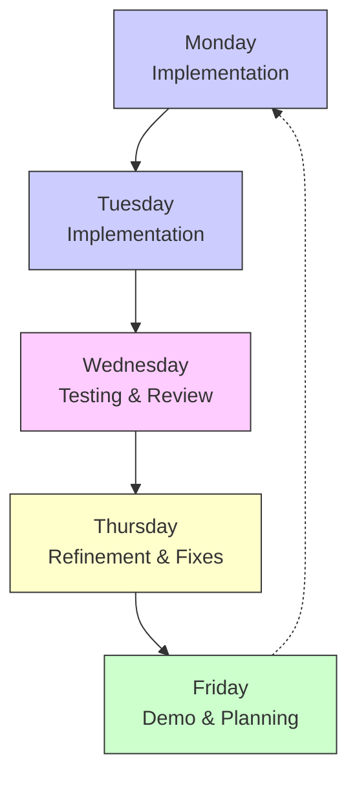

# About Time - Weekly Development Cycle

This document outlines our weekly development cycle designed to promote slow, deliberate progress with thorough testing and documentation. Following this cycle helps us maintain quality while avoiding feature creep.

## Weekly Schedule Overview

## Detailed Daily Activities

### Monday: Implementation Focus

**Morning (9:00 AM - 10:00 AM)**
- Weekly kickoff meeting
- Review tasks for the week
- Clarify any outstanding questions
- Assign specific tasks

**Development (10:00 AM - 5:00 PM)**
- Focus on core implementation
- Pair programming for complex tasks
- Create new tests for functionality
- Document API endpoints as they're created

**End of Day (5:00 PM - 5:30 PM)**
- Brief standup to discuss progress
- Document any new questions
- Update tasks.md with progress

### Tuesday: Implementation Continuation

**Morning (9:00 AM - 9:30 AM)**
- Quick standup
- Address any blockers from Monday
- Re-prioritize if needed

**Development (9:30 AM - 5:00 PM)**
- Continue implementation
- Complete core functionality for the week's features
- Ensure tests are written alongside code
- Document code as it's written

**End of Day (5:00 PM - 5:30 PM)**
- Brief standup to discuss progress
- Flag any concerns for Wednesday review
- Update tasks.md with progress

### Wednesday: Testing & Review

**Morning (9:00 AM - 9:30 AM)**
- Quick standup
- Outline testing priorities
- Assign review pairs

**Testing (9:30 AM - 12:30 PM)**
- Run comprehensive tests
- Add missing test cases
- Document test scenarios
- Verify edge cases

**Code Review (1:30 PM - 5:00 PM)**
- Conduct thorough code reviews
- Check documentation completeness
- Verify against requirements
- Check for feature creep

**End of Day (5:00 PM - 5:30 PM)**
- Compile list of issues to address
- Prioritize fixes for Thursday
- Update tasks.md with review findings

### Thursday: Refinement & Fixes

**Morning (9:00 AM - 9:30 AM)**
- Quick standup
- Review issues from Wednesday
- Assign fixes

**Fixes & Refinement (9:30 AM - 4:00 PM)**
- Address issues from code review
- Fix failing tests
- Improve documentation
- Refine user experience

**Pre-Demo Preparation (4:00 PM - 5:30 PM)**
- Verify all critical fixes are complete
- Prepare demo script for Friday
- Test demo flow
- Update tasks.md with completion status

### Friday: Demo & Planning

**Morning (9:00 AM - 10:30 AM)**
- Demo preparation
- Final testing of demo features
- Review accomplishments for the week

**Demo (11:00 AM - 12:00 PM)**
- Present completed features
- Demonstrate functionality
- Gather feedback
- Document feedback for next week

**Retrospective (1:30 PM - 2:30 PM)**
- Discuss what went well
- Identify improvement areas
- Review velocity and quality
- Check for feature creep issues

**Planning (2:30 PM - 4:30 PM)**
- Plan next week's tasks
- Update tasks.md
- Review questions and decisions log
- Identify potential roadblocks

**Week Closeout (4:30 PM - 5:00 PM)**
- Summarize weekly accomplishments
- Document outstanding questions
- Celebrate progress

## Documentation Responsibilities

Each day includes specific documentation responsibilities:

### Monday
- Document initial API designs
- Create test scenarios
- Update technical documentation with implementation plans

### Tuesday
- Document code with comments
- Update API documentation with completed endpoints
- Record any architectural decisions

### Wednesday
- Review all documentation for completeness
- Create missing documentation
- Verify documentation matches implementation

### Thursday
- Update documentation based on review feedback
- Create user-facing documentation for new features
- Ensure code comments are adequate

### Friday
- Finalize all documentation for the week's work
- Update project status documents
- Document any open questions or decisions

## Weekly Deliverables

Each week should produce:

1. **Working Code**
   - Implemented features
   - Tests for those features
   - Passing CI/CD pipeline

2. **Documentation**
   - Updated technical documentation
   - User documentation for new features
   - API documentation updates

3. **Quality Assurance**
   - Test results
   - Code review feedback
   - Performance metrics

4. **Planning Artifacts**
   - Updated tasks.md
   - Next week's priorities
   - Questions and decisions log updates

## Feature Creep Prevention Checkpoints

We include specific checkpoints to prevent feature creep:

### Wednesday Code Review
- Verify all implemented features trace back to PRD
- Flag any functionality that exceeds requirements
- Ensure code focuses only on current week's tasks

### Friday Retrospective
- Review any scope changes suggested during the week
- Document any parked features in feature_parking_lot.md
- Reaffirm commitment to MVP scope

## UV Package Management Integration

Package management activities are integrated into our weekly cycle:

### Monday
- Review any package updates needed for the week
- Update packages using UV at the beginning of the week

### Thursday
- Verify all package dependencies are properly documented
- Ensure lock files are updated and committed
- Run security checks on dependencies

## Communication Schedule

Regular communication ensures everyone stays aligned:

- **Daily Standups**: 15 minutes at start of day
- **End-of-Day Updates**: Brief written updates in shared document
- **Wednesday Review Meeting**: Formal review of the week's progress
- **Friday Demo**: Presentation of completed work
- **Friday Planning**: Collaborative planning session for next week
